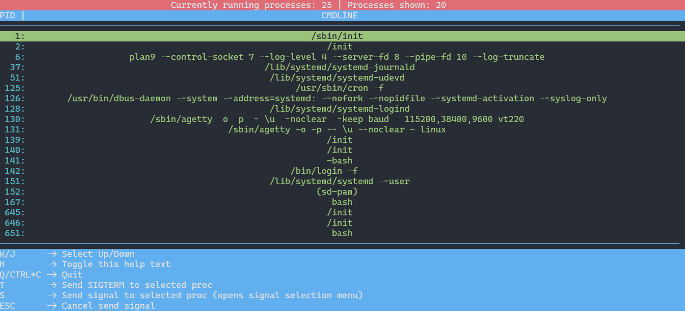

# sysdeck

> [!WARNING]
> This project is currently very unfinished and is only a proof of concept

`sysdeck` is a minimalistic process viewer/system monitor inspired by the likes of `top` and `htop`.



`sysdeck` is meant to be a more educational project so it doesn't use `ps` for retrieving system information and instead manually scans system files for information.

The project only makes use of `libc`, so there are no dependencies. (Some non-standard POSIX functions are used, but no additional linking is necessary)

The only 'dependency' is the Linux `tput` command for easy portability, though replacing it with manual `terminfo` parsing is planned.

# Build Instructions
```console
  $ make
  $ ./main
```
